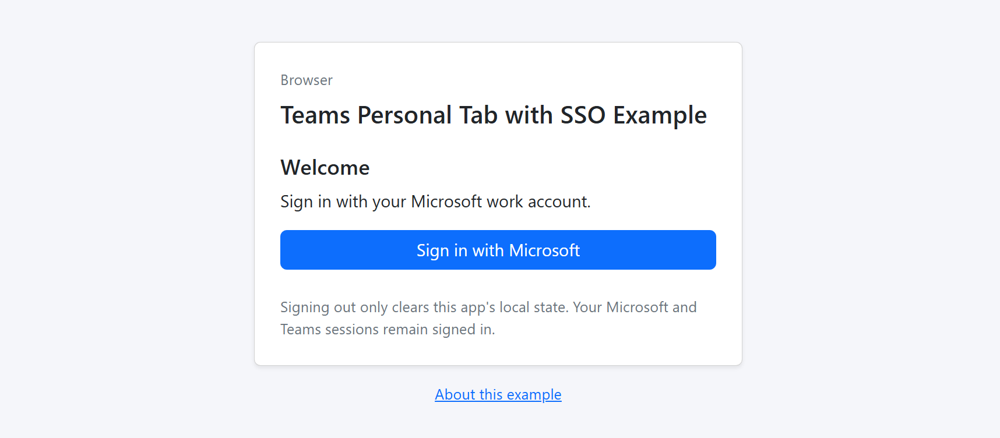
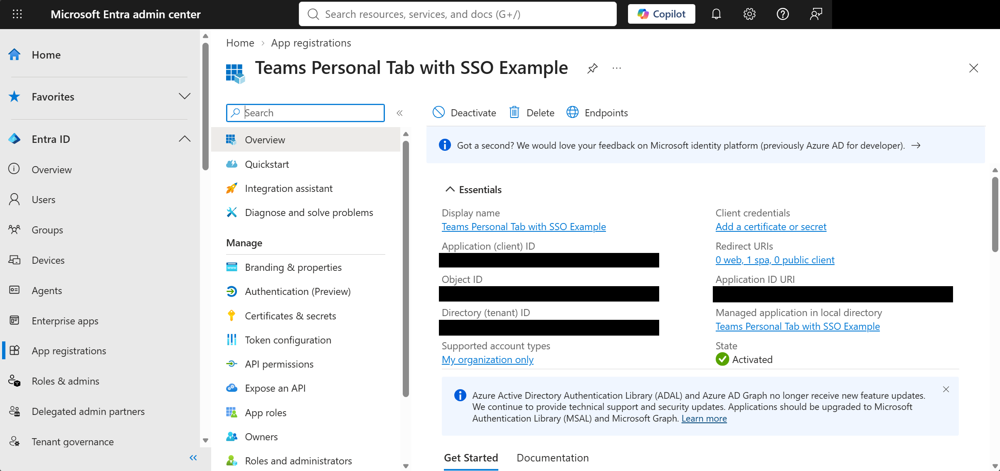
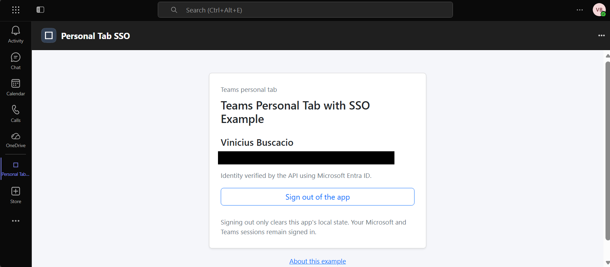

# Teams Personal Tab with SSO Example

> **Projeto não oficial:** Este repositório é um projeto educacional independente.
> Não é um repositório, produto ou exemplo oficial da Microsoft. A Microsoft não
> endossa, patrocina, mantém nem oferece suporte técnico a este projeto.
> As referências a produtos, SDKs, documentação e exemplos da Microsoft têm
> finalidade de identificação e aprendizado e não implicam vínculo institucional
> ou aprovação da Microsoft.

> **Aviso de responsabilidade:** Este é um exemplo educacional, fornecido
> **"AS IS" (no estado em que se encontra)**, sem garantias de suporte, manutenção,
> segurança ou adequação para uso em produção. Use por sua conta e risco.
> Na medida permitida pela legislação aplicável, os autores e titulares dos
> direitos autorais excluem sua responsabilidade conforme a [licença MIT](LICENSE).

Exemplo educacional com **duas telas simples em Bootstrap**: login e perfil
autenticado com **Sair do aplicativo**. O mesmo site e a mesma API funcionam
no navegador e como aba pessoal do Teams.

Inspirado no [Personal Tab SSO Quickstart da Microsoft](https://github.com/OfficeDev/Microsoft-Teams-Samples/tree/main/samples/TeamsJS/tab-personal-sso-quickstart/ts).
Esta implementação foi escrita para este exemplo; não é uma cópia do
quickstart nem um produto endossado pela Microsoft. Não utiliza bot, Graph,
OBO, banco de dados, IA, client secret ou captura de senhas.

## Como funciona

| Contexto | Entrada | Saída |
| --- | --- | --- |
| Navegador | **Entrar com Microsoft** abre o Entra ID oficial em popup; MSAL usa authorization code com PKCE. | Limpa perfil e cache MSAL local, sem chamar logout global. |
| Teams | Inicializa TeamsJS e tenta `getAuthToken({ silent: true })`. O botão permite nova tentativa com interação do host quando necessária. | Limpa o perfil do exemplo; não encerra a sessão do Teams nem remove seu cache SSO. |

O frontend envia o access token apenas no cabeçalho `Authorization: Bearer`
para `GET /api/me`. O servidor valida assinatura RS256 via JWKS, issuer v2,
tenant, audiência exata da API, validade temporal, `oid`, cliente autorizado
e escopo delegado `access_as_user`. Tokens Graph e tokens app-only são
recusados. Nome e login são informativos; a identidade usada na autorização
é a combinação de `tid` e `oid`.
A tela só aparece autenticada após uma resposta válida da API.

Tokens ficam em memória, não em URLs, logs ou banco. Somente um marcador
booleano de saída local é gravado em `sessionStorage`; ele impede o login
automático imediato, inclusive ao recarregar a mesma aba. Uma nova aba ou sessão
pode usar SSO novamente. Isso **não revoga tokens**, não encerra a sessão
Microsoft e não substitui uma política de logout corporativo. A nova entrada
explícita pode reaproveitar a sessão Microsoft sem pedir senha.

Tela inicial no navegador, com entrada pela conta corporativa Microsoft:



## Requisitos

- Node.js **24 LTS**, npm e um navegador atual.
- Para autenticação real: tenant Microsoft Entra ID, usuário desse tenant,
  permissão para registrar/configurar um aplicativo e consentimento conforme
  a política da organização.
- Para Teams: HTTPS com certificado confiável, um domínio configurável
  (pode ser um túnel de desenvolvimento) e permissão para carregar apps
  personalizados. Não é necessário hospedar no Azure.

`npm test` e `npm run build` **não precisam de tenant, túnel ou configuração real**.
Os testes utilizam IDs e chaves sintéticos.

## 1. Registrar um único aplicativo no Entra ID

Defina sua origem HTTPS, por exemplo `https://tab.example.com`, sem caminho,
barra final ou porta não padrão. Os exemplos abaixo são placeholders.

1. No [Microsoft Entra admin center](https://entra.microsoft.com), abra
   **App registrations > New registration**. Escolha **Accounts in this
   organizational directory only (Single tenant)**. Anote **Directory
   (tenant) ID** e **Application (client) ID**.
2. Em **Manifest**, configure `api.requestedAccessTokenVersion` como `2`.
   Preserve as demais propriedades do registro.
3. Em **Authentication > Add a platform > Single-page application (SPA)**,
   registre exatamente `https://tab.example.com/auth/callback.html`.
   Não selecione Web, não habilite implicit grant, não habilite public client
   flows e não crie segredo/certificado para este exemplo.
4. Em **Expose an API**, configure o Application ID URI como
   `api://tab.example.com/<APPLICATION_CLIENT_ID>`.
   O domínio deve ser o mesmo que hospeda a aba. Se uma política de
   identificadores/consentimento impedir a configuração, solicite apoio do
   administrador; não relaxe a validação da API.
5. Adicione e habilite o escopo **`access_as_user`**. Sugestão de nome de
   consentimento: "Acessar o exemplo como usuário"; descrição: "Permite
   consultar o próprio nome e identificador de entrada neste exemplo".
   Defina quem pode consentir conforme a política do tenant; se for
   **Admins only**, o administrador precisa conceder consentimento.
6. Em **API permissions > Add a permission > My APIs**, selecione este
   próprio registro, **Delegated permissions > access_as_user**. Conceda
   consentimento administrativo se exigido pela política. Remova a
   permissão Graph `User.Read` criada por padrão se estiver presente:
   o exemplo não chama Graph. MSAL pode solicitar os escopos padrão
   de protocolo `openid`, `profile` e `offline_access`.
7. Em **Expose an API > Authorized client applications**, adicione os
   dois IDs oficiais abaixo e marque `access_as_user` para cada um:

   | Cliente Teams | ID público oficial |
   | --- | --- |
   | Desktop/mobile | `1fec8e78-bce4-4aaf-ab1b-5451cc387264` |
   | Web | `5e3ce6c0-2b1f-4285-8d4b-75ee78787346` |

8. Se o token não incluir `preferred_username`, configure o optional claim
   **`upn`** para **Access tokens**, se disponível em seu tenant. A API aceita
   `preferred_username` ou `upn`; quando ambos estiverem ausentes, a tela informa
   essa ausência em vez de inventar um e-mail. Claims de exibição não são
   chaves de autorização.

O navegador e a API usam o mesmo client ID, correspondente a um único registro;
a audiência dos tokens v2 esperada pela API é esse **GUID**, não o URI `api://...`.
O escopo solicitado é `api://tab.example.com/<APPLICATION_CLIENT_ID>/access_as_user`.

Visão geral do registro do aplicativo no Microsoft Entra ID, com os
identificadores e o Application ID URI ocultos:



## 2. Configurar e executar localmente

Na pasta do projeto, usando PowerShell:

```powershell
npm install
Copy-Item sso-config.example.json sso-config.json
Copy-Item teams-package.example.json teams-package.json
```

Edite `sso-config.json` com os valores do seu registro:

```json
{
  "tenantId": "<DIRECTORY_TENANT_ID>",
  "clientId": "<APPLICATION_CLIENT_ID>",
  "origin": "https://tab.example.com"
}
```

Em `teams-package.json`, informe o nome real do responsável e um **novo
GUID para o aplicativo Teams**, distinto conceitualmente do registro Entra.
Para gerar esse GUID, use `[guid]::NewGuid()`:

```json
{
  "appId": "<NEW_TEAMS_APP_GUID>",
  "developerName": "<YOUR_ORGANIZATION>"
}
```

Os arquivos reais, builds e ZIPs são ignorados pelo Git. Placeholders
deliberadamente **não passam** na validação de configuração.
Não coloque segredos nesses arquivos.

```powershell
npm test
npm run build
npm start
```

O servidor escuta apenas `127.0.0.1:3000` por padrão. `PORT` e `HOST`
podem ser definidos pelo ambiente quando a hospedagem exigir.
`npm run dev` constrói a interface e reinicia o servidor ao alterar seus
arquivos TypeScript; **reinicie esse comando para reconstruir alterações
na interface**. Não é um servidor Vite com HMR.

O login requer a origem HTTPS configurada, mesmo no navegador. Para testar
com Teams, configure por sua conta um túnel HTTPS que encaminhe para
`http://127.0.0.1:3000`; nenhum comando deste projeto cria recursos ou túneis.
Evite um proxy que intercepte autenticação, injete scripts ou modifique
cabeçalhos. Não exponha a raiz do projeto: somente o Express e `dist`.

Se o domínio mudar, atualize **juntos** `origin`, redirect URI SPA, Application
ID URI, escopo/permissão no Entra e pacote Teams. Reinicie o servidor e
importe novamente o pacote. Conteúdo e API permanecem na mesma origem;
não existe CORS aberto nem modo que ignore autenticação.

## 3. Gerar e importar o aplicativo Teams

```powershell
npm run teams:package
```

O comando cria `appPackage\teams-personal-tab.zip`, com `manifest.json`,
`color.png` (192 x 192) e `outline.png` (32 x 32) na raiz. Os ícones
geométricos são gerados por este projeto, sem marca Microsoft.
O gerador valida o manifesto **1.23** com uma cópia local do schema oficial,
confere dimensões e recusa sobrescrever um ZIP existente. Para outra saída:

```powershell
npm run teams:package -- sso-config.json teams-package.json appPackage\personal-tab-v2.zip
```

O manifesto usa `staticTabs` com escopo `personal`, `webApplicationInfo`
do registro Entra e `validDomains` com somente o domínio configurado.
O parâmetro `?host=teams` solicita a inicialização do SDK, **não autentica**.
Frames e hosts nativos também são reconhecidos; uma falha do SDK não aciona
o login de navegador silenciosamente. Abra a URL sem esse parâmetro para
testar no navegador normal.

No Teams, use **Apps > Manage your apps > Upload an app > Upload a custom
app** (rótulos podem variar) e selecione o ZIP. Se a opção não aparecer,
o administrador precisa liberar upload/uso de apps personalizados conforme
as políticas de gerenciamento, configuração e disponibilidade de apps.
Validar o ZIP localmente não garante aprovação dessas políticas nem
publicação no catálogo.

Perfil autenticado no aplicativo instalado como aba pessoal do Teams:



Antes de distribuir, substitua as páginas de exemplo de suporte,
privacidade e termos pelos contatos e textos adequados da organização.

## Validação e diagnóstico

```powershell
npm run typecheck
npm test
npm run build
```

Os testes cobrem assinatura com JWKS sintético, audiência/issuer/tenant,
expiração, escopo delegado, clientes, API sem token, falhas de dependência,
duas telas, logout local, resposta obsoleta, 401, popup e erros do Teams,
validações de configuração, schema e conteúdo do ZIP. Não há linter configurado.

Teste real esperado, após configurar seu ambiente:

1. Navegador: tela de login, popup oficial Microsoft, consentimento/MFA
   quando exigidos, perfil confirmado pela API.
2. Teams web, desktop e mobile: SSO usando a conta do host; se houver
   interação necessária, use **Entrar com Microsoft**. Falhas persistentes
   de consentimento/MFA podem exigir ação do administrador ou nova entrada
   no próprio Teams; não há fallback de senha, Graph ou NAA.
3. Ambos: **Sair do aplicativo** volta ao login; recarregar a mesma aba
   não entra automaticamente. Clicar em entrar permite nova autenticação.

| Sintoma | Verificação |
| --- | --- |
| `SSO_CONFIG_LOAD_FAILED` | Arquivo local, GUIDs, origem HTTPS exata e ausência de campos extras. |
| `AUTH_ORIGIN` | Abra a origem configurada, não `localhost` ou outro domínio. |
| `AUTH_TEAMS_INIT` / `AUTH_TEAMS_TIMEOUT` | Reabra no Teams; confira carregamento do SDK, CSP e rede do host. |
| `AUTH_INTERACTION` / `AUTH_TEAMS_TOKEN` | Consentimento, clientes pré-autorizados, tenant da conta, escopo e `webApplicationInfo`. |
| `AUTH_POPUP` | Permita popups; conclua entrada/consentimento/MFA sem fechar a janela. |
| `AUTH_BACKEND_401` | Token v2, audiência GUID da API, tenant, escopo e relógio do servidor. O Teams pode devolver o mesmo token em cache na segunda tentativa. |
| HTTP 503 | A API não conseguiu validar a identidade; confira acesso a `login.microsoftonline.com`/JWKS. Não aceite token sem assinatura. |
| `AUTH_STORAGE` / `AUTH_CLEAR` | Permita armazenamento da sessão; se a limpeza falhar, feche a aba. |
| `PACKAGE_FAILED` | Placeholders, nome do responsável (1 a 32 caracteres), caminhos/permissões ou ZIP já existente. |

A CSP permite os hosts Teams documentados e o Entra para autenticação.
A página `/auth/callback.html` é uma bridge MSAL separada, com
`frame-ancestors 'self'`, sem COOP. Não configure o proxy para adicionar
COOP nessa página nem `X-Frame-Options: DENY/SAMEORIGIN` na aba principal.
Não habilite logs HTTP que gravem `Authorization`, códigos OAuth ou tokens.

**Limite das evidências:** testes locais usam mocks dos SDKs e chaves
sintéticas; não comprovam login real, políticas corporativas, comportamento
de popup ou compatibilidade de todos os clientes Teams. Execute a lista
manual acima no tenant escolhido antes de distribuir.

## Referências e direitos

- [Visão geral do SSO em abas](https://learn.microsoft.com/en-us/microsoftteams/platform/tabs/how-to/authentication/tab-sso-overview)
- [Registro Entra e clientes Teams autorizados](https://learn.microsoft.com/en-us/microsoftteams/platform/tabs/how-to/authentication/tab-sso-register-aad)
- [TeamsJS: obter e validar token](https://learn.microsoft.com/en-us/microsoftteams/platform/tabs/how-to/authentication/tab-sso-code)
- [MSAL Browser v5: redirect bridge](https://learn.microsoft.com/en-us/entra/msal/javascript/browser/redirect-bridge)
- [CSP e requisitos de abas](https://learn.microsoft.com/en-us/microsoftteams/platform/tabs/how-to/tab-requirements)
- [Schema oficial do manifesto 1.23](https://developer.microsoft.com/json-schemas/teams/v1.23/MicrosoftTeams.schema.json),
  obtido em 30/09/2026, preservado em `scripts\schemas\MicrosoftTeams.schema.json`
  para validação offline; artefato de terceiros da Microsoft, não de autoria deste projeto.

## Licença

O código e a documentação originais deste repositório são licenciados sob a
[licença MIT](LICENSE). Copyright (c) 2026 Vinicius Buscacio.

Você pode usar, copiar, modificar e distribuir o software, inclusive para fins
comerciais, desde que preserve os avisos exigidos pela licença. O software é
fornecido **"AS IS" (no estado em que se encontra)**, sem garantia, com a limitação
de responsabilidade prevista na licença. Cabe a você avaliar, configurar,
proteger e testar qualquer implantação no seu ambiente.

Bibliotecas de terceiros, o schema de manifesto do Microsoft Teams e marcas e
conteúdos de terceiros exibidos nas capturas de tela conservam seus respectivos
direitos e termos. A licença MIT não substitui esses termos nem implica endosso
da Microsoft ou de qualquer outro terceiro.
